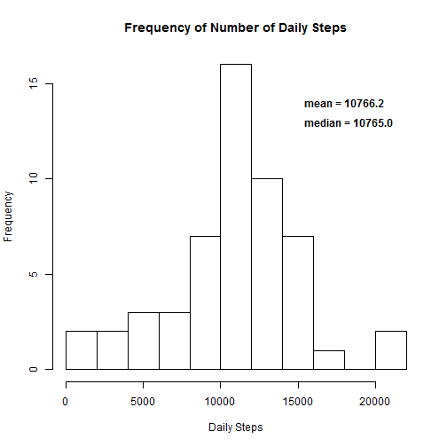
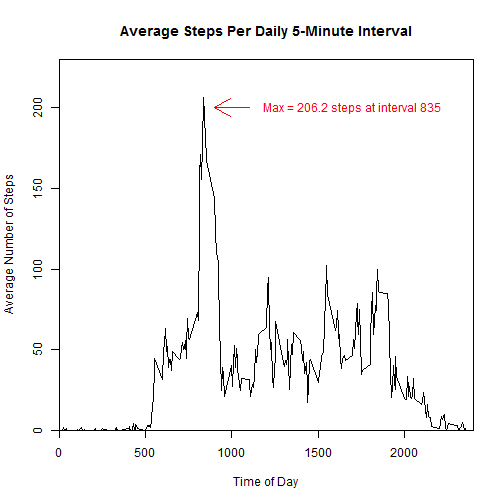
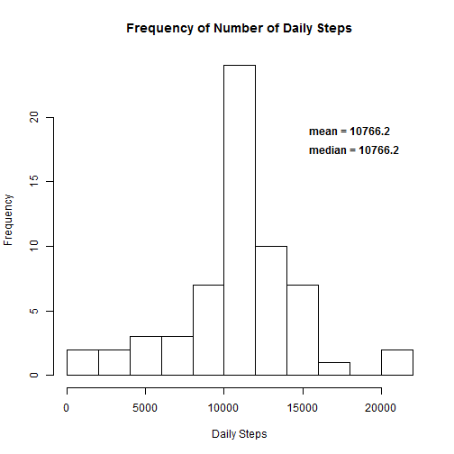
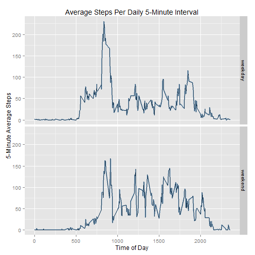

                      
## Loading and preprocessing the data


```r
   rawData <- read.csv("activity.csv", header=TRUE)
   rawData$date <- as.Date(rawData$date, "%Y-%m-%d")
```

## What is mean total number of steps taken per day?


```r
   library(dplyr, warn.conflicts=FALSE)
   dailySteps <- aggregate(steps~date, data=rawData, FUN=sum)
   meanSteps <- sprintf("%5.1f", mean(dailySteps$steps))
   medianSteps <- sprintf("%5.1f", median(dailySteps$steps))
   hist(dailySteps$steps, xlab="Daily Steps", main="Frequency of Number of Daily Steps", breaks=10)
   text(18000,14, paste("mean =",meanSteps), font=2)
   text(18300,13, paste("median =",medianSteps), font=2)
```

 

## What is the average daily activity pattern?


```r
   intervalAvg <- aggregate(steps~interval, ignore.na=TRUE, data=rawData, FUN=mean)
   maxSteps <- max(intervalAvg$steps)
   maxInterval <- intervalAvg[(intervalAvg$steps == maxSteps),]$interval
   xl <- "Time of Day"
   yl <- "Average Number of Steps"
   titl <- "Average Steps Per Daily 5-Minute Interval"
   plot(intervalAvg, type='l', main=titl, xlab=xl, ylab=yl, xaxs='i', yaxs='i', xlim=c(0,2400), ylim=c(0,230))
   text(1700, 200, labels=paste("Max =",sprintf("%3.1f",maxSteps),"steps at interval",maxInterval), col="red")
   arrows(900,200,1100,200, col=2, code=1)
```

 

## Imputing missing values
###There are 2304 missing values in the data, all in the steps column.  I replaced them with the interval mean values calculated above (intervalAvg), which causes the median to shift a little but does not change the overall mean.


```r
   library(Hmisc, warn.conflicts=FALSE, quietly=TRUE)
   filledData <- rawData 
   for (i in seq_along(filledData$steps)) {
      if ( is.na(filledData[i,]$steps) ) {
         I <- filledData[i,]$interval
         filledData[i,]$steps <- (intervalAvg[intervalAvg$interval==I,]$steps)
      }
   }
   impSteps <- aggregate(steps~date, data=filledData, FUN=sum)
   meanImSteps <- sprintf("%5.1f", mean(impSteps$steps))
   medianImSteps <- sprintf("%5.1f", median(impSteps$steps))
   hist(impSteps$steps, xlab="Daily Steps", main="Frequency of Number of Daily Steps", breaks=10)
   text(18000,19, paste("mean =",meanImSteps), font=2)
   text(18300,17.5, paste("median =",medianImSteps), font=2)
```

 

## Are there differences in activity patterns between weekdays and weekends?


```r
   filledData$dayType <- as.factor(ifelse( (weekdays(filledData$date)!="Saturday" & 
                         weekdays(filledData$date)!="Sunday"), "weekday", "weekend"))
   dayTypeSteps <- aggregate(steps~interval+dayType, data=filledData, FUN=mean)
   qplot(interval, steps, data=dayTypeSteps, geom="line") +
   facet_grid(dayType~.) +
   labs(x="Time of Day", y="5-Minute Average Steps", title="Average Steps Per Daily 5-Minute Interval") +
   geom_line(color="steelBlue", size=1, alpha=.5)
```

 
   
